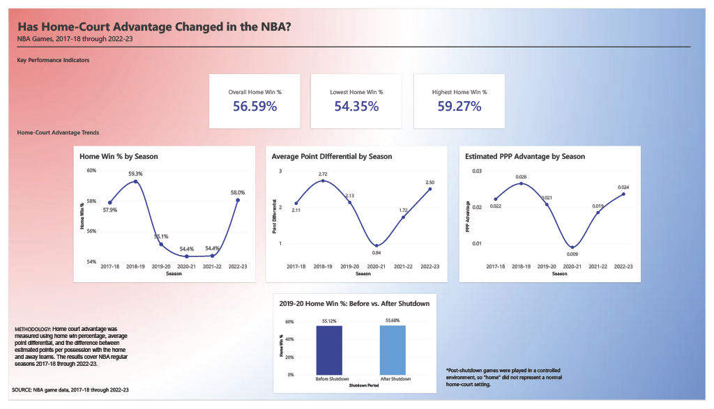

# NBA-Home-Court-Advantage

## Project Overview 

An analysis of NBA regular season games from 2017-18 to 2022-23 to examine how home-court advantage has changed over time. This project uses SQL to clean and analyze game data and Power BI to visualize home win percentage, point differential, and offensive efficiency.  

## Tools and Skills
- SQL
- Power BI: DAX, writing functions, data visualization, data modeling 

## Project Objectives
- Measure home win percentage across NBA seasons
- Analyze differences in home-team point differential
- Compare home and away offensive efficiency using estimated points per possession (PPP)
- Examine home court advantage before and after the shutdown during the 2019-20 season
- Build an interactive dashboard to communicate findings 

## Data & Analysis 
The analysis covers NBA regular season games from 2017-18 through 2022-23. 

Key metrics include:
- Home win percentage
- Average difference of point differential
- Home and away points per possession
- Home win percentage before and after the 2019-20 shutdown

## Methodology 
1. SQL was used to:
   - Clean and prepare game data
   - Check for missing and invalid values
   - Calculate home win percentage, average point differential, possessions, and points per      possession
   - Compare home court advantage before and after the 2019-20 shutdown
  
2. Power BI dashboard presents:
   - KPI cards for overall, lowest, and highest home win percentage
   - Home win percentage trends by season
   - Average home point differential by season
   - Points per possession trends
   - Home win percentage before and after the season shutdown
  
## Key Findings 
- Home win percentage peaked at 59.27% in 2018-19 and fell to 54.35% in 2020-21 before recovering to 58.05 in 2022-23.
- Average home point differential followed a similar pattern, where it peaked at 2.72 in 2018-19 to 0.94 in 2020-21 before recovering to 2.50 in 2022-23.
- Similarly to win percentage and point differential, PPP peaked at 0.026 in 2018-19 and fell to 0.009 in 2020-21 before rising to 0.024 in 2022-23.
- Home win percentage was 55.12% before the 2019-20 season shutdown and 55.68% afterward, a difference of 0.56%.

Context: The 2019-20 and 2020-21 seasons were affected by the COVID-19 pandemic. The 2019-20 season was interrupted in March 2020, with play later resuming in a controlled, isolated environment referred to as the “NBA Bubble”, so it did not represent a normal home court setting. The 2020-21 season was also working under pandemic-related restrictions, including unusual scheduling and reduced arena attendance. This context is important when interpreting the decline in the home statistical advantages during this period. 

## Project Structure 
- `SQL/` : SQL queries used for data cleaning, calculations, and analysis
- `Power BI/` : Power BI dashboard and visualization files
- `README.md` : Project documentation and findings

## Conclusion
The analysis shows that NBA home court advantage varied across the six seasons studied. Home win percentage, point differential, and the home team's offensive efficiency advantage all declined around the 2020-21 season before recovering in 2022-23. The results demonstrate how SQL and Power BI can be used together to analyze and communicate sports data. 
